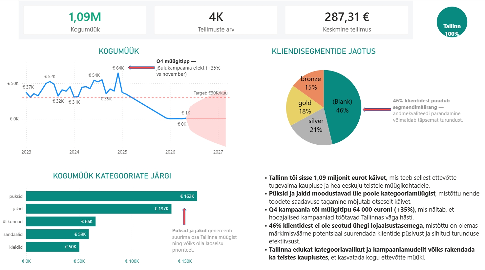

# UrbanStyle Müügianalüüs ja RFM-Kliendisegmentatsioon

## Äriprobleem
UrbanStyle juhtkond vajas sisendit eeloleva aasta turunduseelarve planeerimiseks ja lojaalsusprogrammi muutmiseks, et lõpetada ebaefektiivsed pime-kampaaniad.

## Peamised järeldused ("So what?")
* Meie analüüs tuvastas, et kõigest 15% UrbanStyle'i püsiklientidest genereerib üle poole ettevõtte 1,09 miljoni eurosest kogukäibest.
* Selle teadmise põhjalt loodud mudel võimaldab juhtkonnal lõpetada kulukad pime-kampaaniad ning suunata turunduseelarve otse kõige tulusamale ja kasumlikumale kliendigrupile.
* Tulemusena hoiab ettevõte kokku turunduskulusid, kasvatab püsiklientide lojaalsust ja suurendab reaalset äritulu.

## Lähenemine ja kasutatud tööriistad
* **Andmebaas & valideerimine:** SQL (Supabase) ristikontrolliks ja päringuteks.
* **Andmete puhastamine:** Python (`pandas`) dublikaatide eemaldamiseks ja andmete korrastamiseks.
* **Analüüs & visuaal:** Power BI kliendimudeli loomiseks ja tulemuste kuvamiseks.

## Projektivisuaal

## Kuidas käivitada
1. Klooni repositoorium: `git clone <sinu-repo-link>`
2. Paigalda vajalikud teegid: `pip install -r requirements.txt`
3. Jooksuta andmetorustik: `python main.py`  
   
## AI Kasutamine
Kasutasin Claude'i SQL päringu veaparandusel ja README teksti viimistlemiseks. Analüütiline loogika ja ärijäreldused on minu omad.
